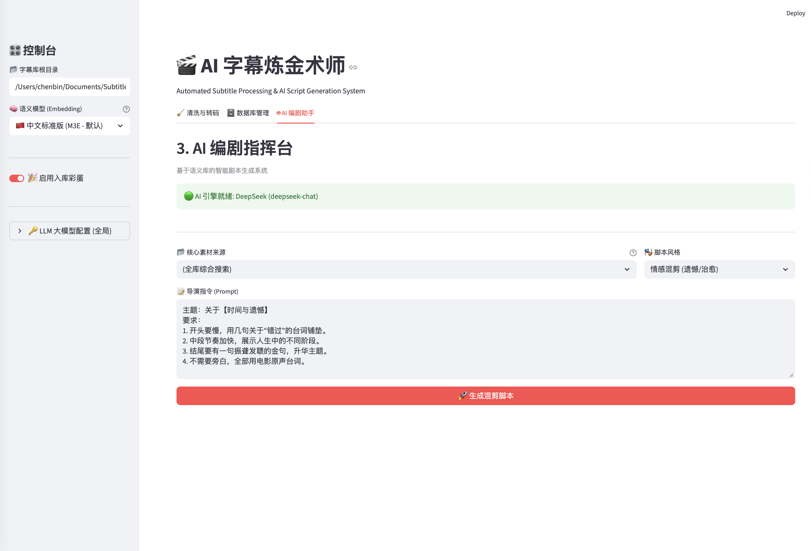

<div align="center">

# 🎬 AI Subtitle Alchemist
### AI 字幕炼金术师

<p align="center">
  <a href="./README.md">English</a> •
  <a href="#-中文说明">中文说明</a>
</p>


**Turn your local subtitles into a semantic knowledge base and creative inspiration.**  
**不仅仅是字幕搜索，更是你的本地视频灵感库。**

> ✨ Built for video creators, editors, and writers who want to *think with subtitles*.
> 
> ✨ 为 **混剪创作者 / 编剧 / 纪录片作者** 打造的本地字幕语义引擎。



</div>

---

## 📝 Disclaimer / 免责声明

<div align="center">
<strong>Please read this section carefully before using the software.</strong><br>
<strong>使用本软件前请务必仔细阅读以下条款。</strong>
</div>

### 🇬🇧 English
1. **Educational Use Only**: This project is intended for **academic research and technical exchange** only.
2. **Copyright Compliance**: Users are responsible for the copyright of the subtitle files and video content they process.
3. **Data Privacy**: All data is stored locally in `subtitle_library.db`. Network access is only required for model downloads or LLM API calls.
4. **No Warranty**: The software is provided "as is", without warranty of any kind.

### 🇨🇳 中文
1. **仅供学习**：本项目仅用于**学术研究和技术交流**。
2. **版权合规**：字幕与视频版权责任由用户自行承担。
3. **数据隐私**：字幕与向量数据均保存在本地 SQLite 数据库中，仅在下载模型或调用 AI 接口时联网。
4. **免责条款**：软件按“原样”提供，开发者不承担任何使用风险。

---

## 🚀 Why AI Subtitle Alchemist?（为什么是它？）

### 🎞 For Video Creators（视频创作者）
- 用「情绪 / 意境」而不是关键词找台词
- 快速生成混剪脚本与分镜思路

### ✍️ For Writers & Scriptwriters（写作者 / 编剧）
- 将多年影视字幕沉淀为可搜索的灵感库
- 让 AI 学习你偏爱的台词风格

### 🧠 For Knowledge Builders（知识管理者）
- 把字幕当作一种“非结构化知识资产”管理
- 本地化、可控、可复用

---

## ✨ Key Features（核心功能）

- **🧹 Intelligent Cleaning（智能清洗）**  
  自动解析并规范混乱字幕文件名，统一转码为 UTF-8 SRT。

- **🧠 Semantic Search（语义搜索）**  
  基于向量模型进行语义级检索，支持“概念找台词”。

- **🤖 AI Scriptwriter（AI 编剧助手）**  
  基于本地字幕知识库生成混剪脚本与分镜创意。
<details>
  <summary>Click to see example (点击查看生成脚本示例)</summary>

  > **Prompt**: "关于【时间与遗憾】，开头要慢，结尾要有一句金句。"
  >
  > **AI Output**:
  > **[00:00 - 00:15]** *画面：电影《星际穿越》库珀离开家*
  > **台词**："我们回不去了。" (来自《后来的我们》)
  > ...
  </details>

- **⚡️ Speed Mode（极速入库）**  
  延迟向量索引，大批量字幕秒级导入。

---

## 🛠️ Installation（安装指南）

### Prerequisites（环境要求）

- Python 3.10+
- 推荐使用 **Anaconda / Miniconda** 进行环境管理

### Quick Start（快速开始）

#### 1. Clone Repository（克隆项目）
```bash
git clone https://github.com/YourUsername/AI-Subtitle-Alchemist.git
cd AI-Subtitle-Alchemist
```

#### 2. Create Conda Environment（创建环境）
```bash
conda create -n subtitle_ai python=3.10
conda activate subtitle_ai
```

#### 3. Install Dependencies（安装依赖）
```bash
pip install -r requirements.txt
```

国内用户可使用镜像：
```bash
pip install -r requirements.txt -i https://pypi.tuna.tsinghua.edu.cn/simple
```

#### 4. Run Application（运行应用）
```bash
streamlit run webui.py
```

浏览器访问 `http://localhost:8501`。

---

## 📖 User Manual（使用手册）

### 🧹 Import & Clean（入库清洗）
- 支持 `.srt / .ass / .vtt`
- 大批量建议开启 **Speed Mode**

### 🗄️ Database Manager（数据库管理）
- 支持关键词 / 语义双模式搜索
- 可随时重建索引

### 🤖 AI Writer（AI 编剧）
- 支持 DeepSeek / OpenAI / Ollama
- 输出 Markdown 脚本

---

## 🗺 Roadmap（路线图）

- [ ] 多语言字幕自动对齐与统一语义空间
- [ ] 语义搜索结果反向定位视频时间轴
- [ ] 一键导出到 Obsidian / Notion
- [ ] 创作者向 Prompt 模板市场

---

## ⚙️ Configuration（配置说明）

首次运行自动生成 `config.json`：
- 默认字幕库路径：`~/Movies/Subtitles`
- 模型缓存：`~/.cache/torch/sentence_transformers`

---

## 🤝 Contribution（贡献）

欢迎提交 PR：
1. Fork
2. Feature Branch
3. Commit
4. Push
5. Pull Request

---

## 📄 License

MIT License

---

<div align="center">Made with ❤️ by YourName</div>

